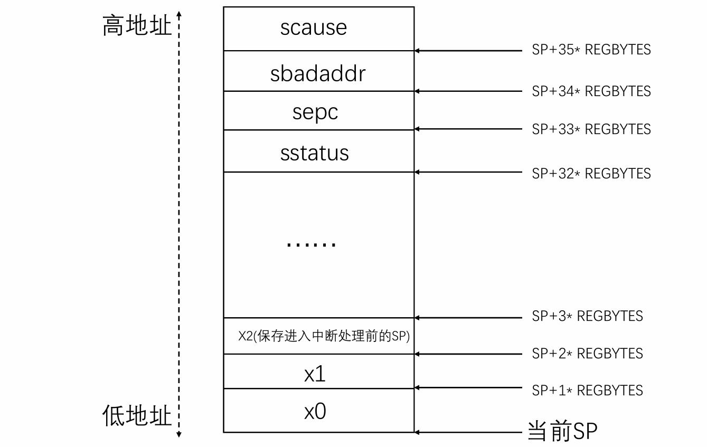

# Lab3

# 练习1：完善中断处理
## 1.实现过程
首先，通过定义宏`PRINT_TICK_NUM`设定在打印十次“100 ticks”后执行关机操作；声明外部函数`sbi_shutdown()`以便调用底层SBI接口实现关机功能；再定义静态打印计数变量`print_count`并初始化为0。
```c
#define PRINT_TICK_NUM 10
extern void sbi_shutdown(void);
static size_t print_count=0;
```
其次，在interrupt_handler函数的中断处理分支中完善对时钟中断IRQ_S_TIMER的响应逻辑：每当触发一次时钟中断时，首先调用clock_set_next_event()设置下一次时钟中断（间隔为100000个时钟周期），然后将ticks加一用于累计中断次数。当ticks达到TICK_NUM（100）的整数倍时，调用print_ticks()在屏幕上输出“100 ticks”提示，并将print_count加一。当print_count累计到PRINT_TICK_NUM（即10次）时，调用sbi_shutdown()函数关闭系统。通过这种方式，系统每经历100次时钟中断打印一次提示，累计10次后自动关机。
```c
case IRQ_S_TIMER:
    clock_set_next_event();
    //在clock_init()中我们已经把ticks初始化为0了
    ticks++;
    if (ticks % TICK_NUM == 0) {
        print_ticks();
        print_count++;
    }            
    if (print_count == PRINT_TICK_NUM) {
        sbi_shutdown();
        }
    break;
```
## 2.定时器中断中断处理的流程/处理中断异常的流程
### 2.1 中断处理的初始化
#### 2.1.1 初始化中断描述符表
在kern_init()中首先调用idt_init()完成两项工作：将__alltraps的地址即本实验中的唯一中断处理程序的地址写入中断向量表基址寄存器stvec，即设置了所有类型的中断异常跳转到这里；将sscratch置零。对应的函数定义如下。
```c
//kern/trap/trap.c
void idt_init(void) {
    extern void __alltraps(void);
    write_csr(sscratch, 0);
    write_csr(stvec, &__alltraps);
}
```
#### 2.1.2 初始化时钟中断
在kern_init()中其次调用clock_init()主要完成三项工作：将SIE寄存器的MIP_STIP位(第5位)置1，表示S模式下允许定时器中断；之后调用clock_set_next_event(void)，这个函数中又调用了sbi_set_timer(get_cycles() + timebase)，即通过sbi_call将特权级从S模式提升到M模式，实现设置下一次定时器中断触发时间为0.01s（由变量timebase设置）后；将时间计数器 ticks初始化为零，以便后续进行正确的计数与打印；除此之外clock_init()打印了一行提示信息。该函数定义代码如下。
```c
//kern/driver/clock.c
void clock_init(void) {
    set_csr(sie, MIP_STIP);
    clock_set_next_event();
    ticks = 0; 
    cprintf("++ 设置定时器中断\n");
}
```
#### 2.1.3 启用IRQ中断
在kern_init()中最后调用intr_enable()：将sstatus寄存器的SIE控制位置1，即开启中断使能位以允许IRQ信号响应，定时器中断就属于一种IRQ。该函数定义如下。
```c
void intr_enable(void) { set_csr(sstatus, SSTATUS_SIE); }
```
### 2.2 一次时钟中断产生后的处理流程
#### 2.2.1 跳转至__alltraps地址处开始中断处理程序的执行
当到达我们通过clock_set_next_event()设置的触发时间时，OpenSBI的时钟事件会触发一个中断，中断产生后根据stvec寄存器中存储的地址值跳转至唯一的中断处理程序trapentry.S处开始执行：首先，展开宏SAVE_ALL，这个 `SAVE_ALL` 汇编宏在中断/异常进入时把当前 CPU 的运行现场完整地保存到栈上，为后续的 trap 处理和最终恢复做好准备。它首先把当前的栈顶指针 `sp` 写入到 CSR `sscratch`，然后把 `sp` 向下移动 `36 * REGBYTES`（每个寄存器占用的字节数）来为一个 `trapFrame` (依次排列32个通用寄存器和4个和中断相关的CSR)分配空间。接着按固定偏移把除x2外的31个通用寄存器逐一保存到新栈帧中，`x2`不直接用当前的 `sp` 保存，而是通过先前存入 `sscratch` 的旧 `sp` 来保留：把 `sscratch`（也就是进入宏前的原始 `sp`）读到通用寄存器 `s0`，同时把 `sscratch` 置为 0，然后把这个原始 `sp` 存回栈帧的 `2*REGBYTES(sp)` 位置，保证 trapFrame 中保存的是进入 trap 之前的栈指针。宏还从若干与中断有关的 CSR 读取当前状态并保存：把sstatus(含多个重要的控制位)保存到 `s1`，把sepc(记录中断发生时的pc值)保存到 `s2`，把sbadaddr(记录发生故障的地址)保存到 `s3`，把scause(记录中断或异常的类型)保存到 `s4`；随后分别把这些 `s0`..`s4` 的值写入到栈帧的高位（`2*REGBYTES` 用于原始 sp，`32*REGBYTES`..`35*REGBYTES` 用于 sstatus/sepc/sbadaddr/scause），因此整个栈帧共有 36 个寄存器槽（0..31 对应通用寄存器，其中有中断发生前的 sp）。在完成SAVE_ALL后，相当于把上下文包装成了结构体，该结构体的起始地址存在`sp`中。
对应的内存布局如下图所示。


之后，将SAVE_ALL在栈上建立的trapframe结构体的地址`sp`复制到寄存器a0，接下来以寄存器a0中的值作为参数调用trap函数。

该部分对应的trapentry.S中的代码如下所示。
```c
__alltraps:
    SAVE_ALL #宏展开：保存上下文
    move  a0, sp #传递参数。
    jal trap #调用trap函数
```
### 2.2.2 执行中断处理函数trap
`trap`函数接收一个保存CPU状态的`trapframe`结构体，然后将处理工作交给`trap_dispatch`函数。`trap_dispatch`通过判断`tf->cause`的符号来区分陷入的类型——如果`cause`为负值（最高位为1），说明是中断，则调用`interrupt_handler`处理；如果为非负值（`cause`最高位为0），说明是异常，则调用`exception_handler`处理异常情况，该函数内部通过switch语句判断异常类型，如取指未对齐、非法指令、断点、访存错误、系统调用等，并在相应的case分支中执行特定的处理逻辑。
```c
static inline void trap_dispatch(struct trapframe *tf) {
    if ((intptr_t)tf->cause < 0) {
        interrupt_handler(tf);
    } else {
        exception_handler(tf);
    }
}
void trap(struct trapframe *tf) {
    trap_dispatch(tf);
}
```
时钟中断属于中断的一种，对应scause寄存器的最高位（Interrupt 位）为1，所以在`trap_dispatch`中`(intptr_t)tf->cause`将无符号的tf->cause转为有符号整型intptr_t，最高位为1，即<0条件成立，调用`interrupt_handler`处理。

函数`interrupt_handler`首先通过对`tf->cause`进行位移操作去掉最高位，得到实际的中断类型字段`cause`，然后使用`switch`语句根据中断类型进行分发。对于不同的中断源，函数会执行相应的操作。当检测到`IRQ_S_TIMER`（管理态定时器中断）时，函数会调用`clock_set_next_event()`设置下一个时钟中断，并更新计时变量`ticks`；当`ticks`达到100时打印时钟信息，打印计数达到10次后调用`shut_down()`关闭系统。其余类型的中断则仅输出提示信息或打印`trapframe`调试信息。该函数对应的定义如下。
```c
//kern/trap/trap.c
void interrupt_handler(struct trapframe *tf) {
    intptr_t cause = (tf->cause << 1) >> 1;
    switch (cause) {
        case IRQ_U_SOFT:
            cprintf("User software interrupt\n");
            break;
        case IRQ_S_SOFT:
            cprintf("Supervisor software interrupt\n");
            break;
        case IRQ_H_SOFT:
            cprintf("Hypervisor software interrupt\n");
            break;
        case IRQ_M_SOFT:
            cprintf("Machine software interrupt\n");
            break;
        case IRQ_U_TIMER:
            cprintf("User Timer interrupt\n");
            break;
        case IRQ_S_TIMER:
            clock_set_next_event();
            ticks++;
            if (ticks % TICK_NUM == 0) {
                print_ticks();
            }
            print_count++;
            if (print_count >= 10) {
                shut_down();
            }
            break;
        case IRQ_H_TIMER:
            cprintf("Hypervisor software interrupt\n");
            break;
        case IRQ_M_TIMER:
            cprintf("Machine software interrupt\n");
            break;
        case IRQ_U_EXT:
            cprintf("User software interrupt\n");
            break;
        case IRQ_S_EXT:
            cprintf("Supervisor external interrupt\n");
            break;
        case IRQ_H_EXT:
            cprintf("Hypervisor software interrupt\n");
            break;
        case IRQ_M_EXT:
            cprintf("Machine software interrupt\n");
            break;
        default:
            print_trapframe(tf);
            break;
    }
}
```
### 2.2.3 恢复上下文并切换回内核态
在trap函数执行结束后，会返回到继续执行trapentry.S中jal trap后面的代码。

首先，展开宏`RESTORE_ALL`来恢复被保存的CPU寄存器状态：首先从当前栈指针`sp`指向的内存中依次取出之前保存的s1与s2寄存器的值，分别写回到sstatus和sepc寄存器中，其中sstatus保存的是中断前的处理器状态，sepc保存的是中断前的程序计数器PC值，用于恢复执行位置，程序会从该位置继续执行。接着，宏通过多条LOAD指令依次将所有通用寄存器x1到x31（除x0、x2外）的值从栈中取回到对应寄存器中，以恢复中断发生前的寄存器内容。最后，单独恢复栈指针x2（保存着中断处理前的栈顶指针值sp），确保栈顶指针回到中断前的位置。

最后，执行sret指令完成四项工作：根据sstatus.SPP的值从S模式切换回中断发生前所处的特权级；将sstatus.SIE恢复为sstatus.SPIE的值，恢复了中断使能状态；更新sstatus中的控制位：将sstatus.SPIE置为1，将sstatus.SPP置为0；跳转到sepc所指的地址开始继续执行。

该部分对应的代码如下。
```c
    .globl __trapret
__trapret:
    RESTORE_ALL
    sret
```
# 扩展练习 Challenge1：描述与理解中断流程
回答：描述ucore中处理中断异常的流程（从异常的产生开始），其中mov a0，sp的目的是什么？SAVE_ALL中寄寄存器保存在栈中的位置是什么确定的？对于任何中断，__alltraps 中都需要保存所有寄存器吗？请说明理由。
## 1.ucore中处理中断异常的流程（从异常的产生开始）
该部分回答同练习1中的2.定时器中断中断处理的流程/处理中断异常的流程。
## 2.mov a0，sp的目的
在kern/trap/trap.h定义了结构体trapframe，C语言里面的结构体是若干个变量在内存里直线排列，并且各个成员在内存中的存放顺序与它们在结构体定义中的声明顺序一致。/kern/trap/trapentry.S中的SAVE_ALL将所有寄存器按照trapframe的声明顺序从低地址到高地址依次存放了32个通用寄存器和四个和中断相关的CSR，这相当于把一个trapFrame结构体放到了栈顶。所以栈顶指针`sp`指向的地址就是这个trapframe结构体在内存中的起始位置。

`mov a0，sp`把当前栈指针寄存器 sp的值复制到参数寄存器a0中。并且，该指令的下一条指令便是`jal trap`。

所以，`mov a0，sp`的目的，是把保存好的trapframe结构体的地址作为参数传递给C语言的`trap(struct trapframe *tf)`函数，使内核能在C代码中通过结构体指针访问和处理中断时保存的寄存器状态。
## 3.SAVE_ALL中寄存器保存在栈中的位置是怎么确定的
首先，通过`addi sp, sp, -36 * REGBYTES`在栈上预留一块空间（向低地址方向移动栈顶），用来保存 36 个寄存器的内容。

其次，必须先保存32个通用寄存器，再保存4个与和中断相关的CSR；因为RISCV不能直接从CSR写到内存, 需要csrr把CSR读取到通用寄存器，再从通用寄存器STORE到内存；如果我们先存4个和中断相关的CSR会覆盖用到的通用寄存器中原有的内容，从而无法将原有的内容存在栈上，无法保存完整的上下文。并且，在 C 语言中定义的`trapframe`结构体明确了每个寄存器字段在内存中的顺序和偏移：顺序依次为x0→x31、sstatus、sepc、sbadaddr、scause，偏移由为每个变量的类型`uintptr_t`决定，每个寄存器字段占8个字节。由于我们希望当 C 代码获得一个`struct trapframe *tf`指针时，就能直接通过`tf->cause`等字段准确访问到汇编保存的那一段内存，不会错位；所以由`trapframe`结构体的定义确定了寄存器保存在栈中的位置：在汇编宏 SAVE_ALL 里，从栈顶开始，按照完全相同的顺序（从低地址到高地址依次存放了32个通用寄存器和四个和中断相关的CSR）和偏移(由REFGBYTES决定，其值为8)把寄存器的值依次写入栈中。
## 4.对于任何中断，__alltraps 中都需要保存所有寄存器吗
对于任何中断，__alltraps 中都需要保存所有寄存器。

理由：由于在本实验的代码中仅有一个中断处理程序，`__alltraps`的值被存储在寄存器`stvec`中，无论发生任何中断或异常，都会跳转至`__alltraps`处执行，中断/异常可能在任何时刻打断正在运行的用户程序（例如时钟中断等），这些事件都会使当前 CPU 寄存器（x0–x31）中保存的重要上下文信息暂时中断。如果不完整地保存这些寄存器，待中断处理结束返回用户态时就无法把程序恢复到中断前的精确状态，程序可能崩溃、寄存器值错乱或行为异常。另一方面，`__alltraps`在保存现场后会` jal trap` 跳到C语言的`trap(struct trapframe *tf)`处理函数——C 编译器在函数体内会自由使用若干寄存器，若事先没有把这些寄存器的原值保全，`trap(struct trapframe *tf)`的执行就会破坏被中断程序的寄存器内容。为此，`SAVE_ALL`必须把所有通用寄存器和关键控制寄存器一并保存，保证：C 层处理函数可以安全使用寄存器而不影响被中断程序；在处理结束（通过 RESTORE_ALL 和 sret）时能够准确恢复 sstatus/sepc 等并把所有通用寄存器还原回中断前的值，从而完全恢复原程序的执行上下文。

# 扩展练习 Challenge2：理解上下文切换机制 
## 1.csrw sscratch, sp; csrrw s0, sscratch, x0 的操作与目的
在trapentry.S中，csrw sscratch, sp; csrrw s0, sscratch, x0这一对指令序列，是一种在不污染任何通用寄存器的情况下，安全备份进入陷阱前原始栈指针sp的技术。其操作流程是，首先通过csrw指令将当前sp的值暂存入sscratch这一CSR中；紧接着，利用csrrw将sscratch的备份值读入s0寄存器，同时将sscratch清零。此举的核心目的在于，为后续SAVE_ALL宏中修改sp以开辟trapframe空间之前，预先将被中断上下文的sp值安全地转移出来，为最终存入trapframe做好准备，整个过程保持了通用寄存器的原始状态直至它们被逐一保存。
## 2.保存 stval 和 scause 的意义
SAVE_ALL宏中保存stval和scause，而在RESTORE_ALL中却不恢复它们，其根本原因在于这两类CSR所承载的信息性质不同。通用寄存器、sepc与sstatus共同构成了被中断程序的执行上下文，是其得以无缝恢复执行的必要状态，因此必须被完整地保存与恢复。相比之下，scause（陷阱原因）和stval（陷阱辅助值）则属于事件信息，它们的作用是向陷阱处理程序报告“发生了什么”以及“为什么发生”，本质上是传递给处理函数的参数。因此，store这些CSR的意义在于，将硬件提供的事件报告打包到trapframe结构体中，从而安全地传递给C语言编写的trap函数进行分析。一旦trap函数完成其使命，这些诊断信息便不再需要，恢复它们没有必要。

# 扩展练习Challenge3：完善异常中断

## 1. 非法指令异常处理实现
本次实验的核心任务之一是实现对非法指令异常的捕获与处理。其目标不仅在于识别并报告此类异常，更关键的是在处理后能够精确地跳过该非法指令，以确保内核能够恢复正常的执行流，而不是陷入无限的异常循环或直接崩溃。

为触发此异常，我们首先在 kern_init 函数中通过内联汇编插入了一条指令。初次尝试使用了全零的32位字作为非法指令，即 asm volatile (".word 0x00000000");。同时，我们在 exception_handler 函数中添加了相应的处理逻辑，用于打印异常类型和触发异常的指令地址。然而，运行测试后，终端输出了一个意外的结果：非法指令异常被连续触发并处理了两次。
```c
cprintf("+++ 触发一条非法指令异常！ +++\n");
asm volatile (".word 0x00000000"); 
cprintf("+++ 非法指令已被处理，继续执行程序。 +++\n");
```

```
// 终端输出的意外结果
++ setup timer interrupts
+++ 触发一条非法指令异常！ +++
Exception type: Illegal instruction
Illegal instruction caught at 0xffffffffc02000a8
Exception type: Illegal instruction
Illegal instruction caught at 0xffffffffc02000aa
+++ 非法指令已被处理，继续执行程序。 +++
```
为了探究其根本原因，我们利用 GDB 调试工具对异常发生时的处理器状态进行了深入分析。当程序因第一次异常中断在 exception_handler 时，我们检查了 trapframe 中的 epc 值，并对该地址处的指令进行反汇编。GDB 的输出揭示了问题的关键：
```
(gdb) p/x tf->epc
$1 = 0xffffffffc02000a8
(gdb) x/2i tf->epc      
   0xffffffffc02000a8 <kern_init+84>:   unimp
   0xffffffffc02000aa <kern_init+86>:   unimp
```
GDB 的反汇编结果明确显示，位于 0xffffffffc02000a8 的4字节零值，**被处理器解释为了两条连续的、长度为2字节的非法指令**。通过与队友交流得知，这是由于我们实验环境中的 RISC-V 处理器支持'C'指令集扩展。根据其编码规则，指令的最低两位决定了其基本长度，0x0000 的最低两位为00，符合16位压缩指令的格式。因此，CPU在执行到 0xa8 地址时，取出前2字节并触发了第一次异常；在我们的处理函数将其 epc 增加2并返回后，CPU又继续执行 0xaa 处的后2字节，从而触发了第二次异常。

基于这一发现，我们修正了触发方式，使用了一个能确保被识别为32位指令的编码 0xFFFFFFFF，因为其最低两位为11。同时，我们实现了更为健壮的异常处理代码，它能够在运行时通过检查指令编码的最低两位来动态判断其长度，无论是16位还是32位指令都能正确处理，从而保证 epc 总是被更新到正确的下一条指令地址。
```c
// 修正后的触发代码（kern/init/init.c）
cprintf("+++ 触发一条非法指令异常！ +++\n");
asm volatile (".word 0xFFFFFFFF"); 
cprintf("+++ 非法指令已被处理，继续执行程序。 +++\n");

// 最终实现的异常处理逻辑（kern/trap/trap.c）
case CAUSE_ILLEGAL_INSTRUCTION:
    cprintf("Exception type: Illegal instruction\n");
    cprintf("Illegal instruction caught at 0x%016lx\n", tf->epc);

    uint16_t instruction = *(uint16_t *)tf->epc;
    if ((instruction & 0x3) != 0x3) // 16-bit 压缩指令
        tf->epc += 2;
    else // 32-bit 标准指令
        tf->epc += 4;
    break;
```
为最终验证实现的正确性，我们再次利用 GDB 设置了两个断点：一个在 exception_handler，另一个在非法指令之后的 cprintf 调用处。程序运行时，首先准确地命中了 exception_handler 断点；继续执行后，成功命中了第二个断点，而没有再次触发异常。
```
(gdb) break exception_handler
Breakpoint 1 at 0xffffffffc0200b60: file kern/trap/trap.c, line 157.
(gdb) break kern/init/init.c:42
Breakpoint 2 at 0xffffffffc02000ac: file kern/init/init.c, line 42.
(gdb) continue
Continuing.

Breakpoint 1, exception_handler (tf=0xffffffffc0205ed0) ...
(gdb) continue
Continuing.

Breakpoint 2, kern_init () at kern/init/init.c:42
42          cprintf("+++ 非法指令已被处理，继续执行程序。 +++\n");
```
最终的终端输出结果也清晰地证明了这一点，非法指令异常只被处理了一次，随后程序正常恢复执行。这一系列调试与修正过程，不仅完成了实验要求，也加深了我们对 RISC-V 指令集编码及异常处理精确性的理解。
```c
// 最终正确的终端输出
++ setup timer interrupts
+++ 触发一条非法指令异常！ +++
Exception type: Illegal instruction
Illegal instruction caught at 0xffffffffc02000a8
+++ 非法指令已被处理，继续执行程序。 +++
100 ticks
QEMU: Terminated
```


## 2. 断点异常处理实现

#### 2.1 断点异常及其触发机制

断点异常是一种同步的、由软件主动触发的陷阱，它与异步的硬件中断或因程序错误引发的同步异常在目的上有所不同，其根本用途是为调试器和开发者提供一个可控的程序执行暂停点。

当处理器执行到断点指令时，会立即中断当前执行流，将控制权移交至预设的异常处理程序。在此暂停状态下，操作系统或调试器得以检查并修改程序的完整上下文（包括寄存器和内存），并决定后续的执行路径，例如单步、继续或终止，这正是 GDB 等调试工具实现其核心断点功能的底层机制。

在 RISC-V 架构中，`ebreak` 是触发断点异常的专用指令。CPU 遇到该指令时，会执行一系列硬件原子操作：首先，将 `ebreak`​ 指令自身的地址保存至 `sepc`​ 寄存器，以备恢复；其次，在 `scause`​ 寄存器中标定异常原因码为 3 ；最后，将PC强制跳转至 `stvec` 寄存器设定的异常向量入口，从而启动内核的异常处理流程。

本次实验的目标即实现该处理流程，并在此基础上构建一个具备基本状态观测和交互式执行控制能力的初级调试器。

#### 2.2 具体实现

为了精确地验证断点异常处理流程的正确性，我们选择在操作系统内核初始化的一个关键且必经的路径上插入断点，具体的测试点位于 `kern_init`​ 函数内部，紧随在 `print_kerninfo()` 函数调用之后：

```c
//测试全局变量初始化(clock.c)：volatile size_t ticks=3333333;
volatile int test = 9;//后续测试变量
test++;
cprintf("+++ Triggering a breakpoint exception! +++\n");
asm volatile ("ebreak");
cprintf("+++ Breakpoint exception handled, resuming. +++\n");
```

我们在 `exception_handler`​ 的 `case CAUSE_BREAKPOINT`​ 分支中，实现了断点异常的核心处理逻辑，包括打印异常信息并更新 `tf->epc` 寄存器以正确恢复执行流。

其中正确更新 `tf->epc`​ 是确保程序能从异常中恢复并跳过 `ebreak`​ 指令的关键，通过 GDB 调试，我们首先读取 `misa`​ 寄存器（`misa 0x800000000014112d RV64ACDFIMSU`​）确认了目标 CPU 支持 'C' (Compressed) 扩展，即指令集包含 16 位（2字节）和 32 位（4字节）两种长度。进一步的 GDB 反汇编分析也证实，本次实验中编译器生成的 `ebreak`​ 指令长度确为 2 字节。然而，为避免因编译器优化选择不同而导致硬编码 `tf->epc += 2`​ 的方式失效，我们实现了一种更健壮的机制：在运行时通过检查指令最低两位的编码来动态判断其长度，从而确保 `epc` 的更新总是正确的。

```
(gdb)break *0xffffffffc02000a6
(gcb)c
(gdb)layout asm
0xffffffffc02000a6 <kern_init+78>:	jal	ra,0xffffffffc02000fc <cprintf>
0xffffffffc02000aa <kern_init+82>:	ebreak
0xffffffffc02000ac <kern_init+84>:	auipc	a0,0x2
```

核心实现代码如下：

```c
case CAUSE_BREAKPOINT:
    cprintf("Exception type: breakpoint\n");
    cprintf("ebreak caught at 0x%016lx\n", tf->epc);
    // 从 epc 读取指令的前 16 位（小端序）
    uint16_t instruction = *(uint16_t *)tf->epc;
    // 通过检查指令最低两位编码来判断其长度
    if ((instruction & 0x3) != 0x3) {
        // 16-bit 压缩指令
        tf->epc += 2;
    } else {
        // 32-bit 标准指令
        tf->epc += 4;
    }
    cprintf("restore at 0x%016lx\n", tf->epc);
    break;
```

输出效果如下：

```
+++ Triggering a breakpoint exception! +++
Exception type: breakpoint
ebreak caught at 0xffffffffc02000aa
restore at 0xffffffffc02000ac
+++ Breakpoint exception handled, resuming. +++
```

说明此时断点异常处理已经具备了基本的停止、陷入、恢复执行流的功能。在此基础上，为了将断点异常的理论价值转化为实际的调试能力，我们进一步扩展了异常处理器的功能，实现了状态观测与交互式控制两种特性。

1. 状态观测：通过解析 `trapframe`​ 结构体，处理程序能够提供关于断点时刻的系统快照。这包括微观的函数级上下文，如传递给当前函数的参数（`a0`​, `a1`​ 寄存器）和反映局部变量 `test`​ 存储的栈内存快照；以及宏观的系统级上下文，如访问内核全局变量 `ticks` 来了解系统的整体时序状态。
2. 交互式控制：我们引入了一个基于 `cons_getc()`​ 的忙等待循环，使内核在报告完所有诊断信息后暂停，等待用户从控制台输入`'c'`指令。此机制将处理器从一个被动的报告员转变为一个初级的交互式内核调试器，赋予了开发者在检查完状态后自主决定何时恢复程序执行的权力。

核心实现代码如下：

```c
case CAUSE_BREAKPOINT:
    cprintf("Exception type: breakpoint\n");
    cprintf("ebreak caught at 0x%016lx\n", tf->epc);

    // 功能 1: 侦察函数内部与全局状态
    cprintf("\n --- Current Function State ---\n");
    cprintf("   Arguments (a0-a1): 0x%lx, 0x%lx\n", tf->gpr.a0, tf->gpr.a1);
    cprintf("   Stack Snapshot (around sp=0x%lx):\n", tf->gpr.sp);
    uintptr_t *sp = (uintptr_t *)tf->gpr.sp;
    for (int i = 0; i < 4; i++) {
        cprintf("     sp+%d: 0x%016lx\n", i * 8, *(sp + i));
    }
    cprintf("\n --- Global State ---\n");
    cprintf("   Current 'ticks' value: %d\n", ticks);

    // 功能 2: 交互式控制
    cprintf("\n >> Type 'c' and press Enter to continue...\n");
    int c;
    while ((c = cons_getc()) != 'c') {
        // busy-wait
    }
    cprintf("  >> 'c' received. Resuming execution.\n");

     // 恢复执行前的 epc 更新
    uint16_t instruction = *(uint16_t *)tf->epc;
    if ((instruction & 0x3) != 0x3) {
        tf->epc += 2;
    } else {
        tf->epc += 4;
    }
    cprintf("restore at 0x%016lx\n", tf->epc);
    break;
```

测试结果如下：

```
+++ Triggering a breakpoint exception! +++
Exception type: breakpoint
ebreak caught at 0xffffffffc02000aa

 --- Current Function State ---
   Arguments (a0-a1): 0x2b, 0x0
   Stack Snapshot (around sp=0xffffffffc0205fe0):
     sp+0: 0x0000000000000000
     sp+8: 0x0000000a00000000 //这里是test，值为10
     sp+16: 0x0000000000000000
     sp+24: 0x0000000080000a02

 --- Global State ---
   Current 'ticks' value: 3333333 //这里是ticks，值为3333333

 >> Type 'c' and press Enter to continue...
  >> 'c' received. Resuming execution. //键入c继续运行
restore at 0xffffffffc02000ac
+++ Breakpoint exception handled, resuming. +++
```

最终的输出结果清晰地验证了所有功能的正确性：程序在 `ebreak` 处暂停，准确报告了包括局部变量在内的系统状态，并在接收到用户指令后，从正确的位置恢复了执行流。
# **实验知识点与 OS 原理的理解**

1. 中断处理机制

    实验部分具体实现了时钟中断的完整处理流程，从中断发生、跳转到统一入口__alltraps、利用SAVE_ALL宏保存所有寄存器上下文、调用C函数trap进行分发处理，到最终通过RESTORE_ALL和sret指令恢复现场并返回。这对应了OS原理中“中断/异常/系统调用的硬件机制”这一知识点，这三者都是通过硬件实现的、能提升CPU权限（如至ring0）并跳转至预设处理函数的机制。
2. 特权级切换

    实验涉及了在RISC-V架构下S模式的中断特权级切换，具体通过intr_enable()设置sstatus寄存器的SIE位来开启中断使能、clock_init()设置sie寄存器的STIP位以允许定时器中断，并在中断返回时使用sret指令完成从S模式切回中断前特权级并恢复中断使能状态。这对应了原理中的“Protection Rings”概念，OS原理中以x86的ring0-ring3为例说明了CPU通过不同特权级实现权限隔离。两者的核心思想一致，即借助硬件机制实现权限隔离与控制；差异主要在于具体实现架构不同，实验基于RISC-V（主要利用页表权限和CSR寄存器），而原理示例是x86（使用特权级环），但本质都是通过硬件支持确保内核（高特权级）受保护且能管理用户程序（低特权级）。
3. 内核地址空间设计

    实验中，上下文保存与恢复的核心是SAVE_ALL和RESTORE_ALL这两个汇编宏以及trapframe结构体。它们严格按照trapframe定义的顺序，在栈上保存和恢复全部的32个通用寄存器以及4个关键控制状态寄存器（CSR），并通过mov a0, sp将栈上构建的trapframe结构体首地址传递给C处理函数。这体现了原理中“内核进入与退出”时需要“保存现场”的概念。原理层面主要强调了保存现场的必要性这一设计思想；而实验则给出了极其具体的技术实现，包括寄存器保存的精确顺序、栈帧的内存布局以及参数传递的方式，确保了中断处理过程中执行流的正确切换与恢复。
# 
